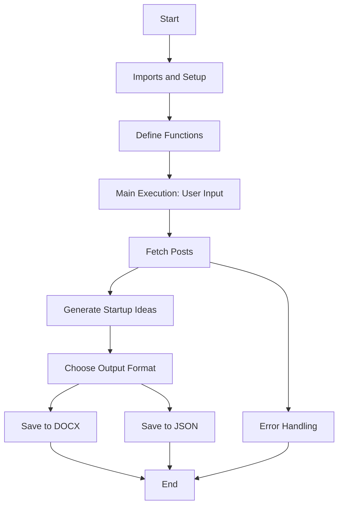

```mermaid
graph TD
    A[Start] --> B[Imports and Setup]
    B --> C[Define Functions]
    C --> D[Main Execution: User Input]
    D --> E[Fetch Posts]
    E --> F[Generate Startup Ideas]
    F --> G[Choose Output Format]
    G --> H[Save to DOCX]
    G --> I[Save to JSON]
    H --> J[End]
    I --> J
    E --> K[Error Handling]
    K --> J
```